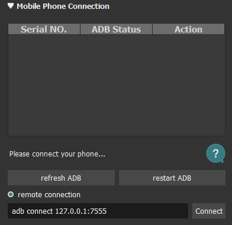
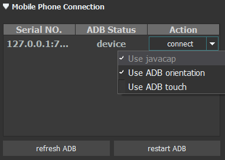
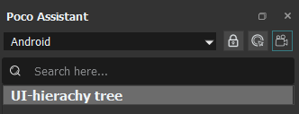
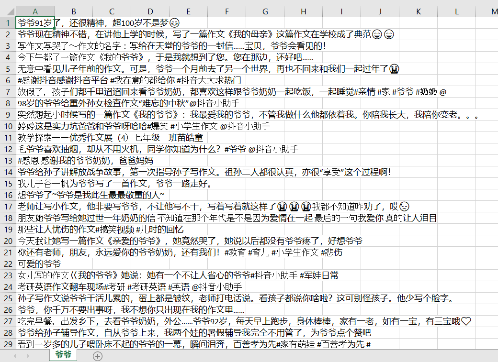
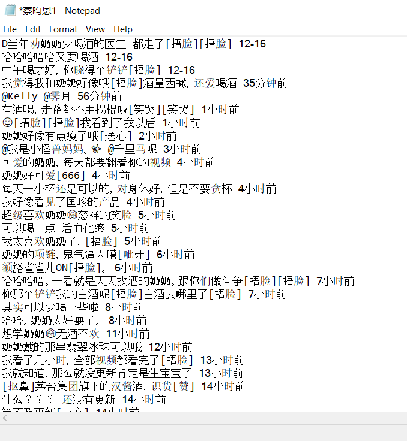

# TikTok crawler


* * *

#### Motivation for the project

I have a background in both geographical information science and information system and I came across an opportunity to be part of a research project to understand how TikTok (a social media video app) serves as an emotional care space for Chinese older people. The completion of this project highly relies on collecting social media data from TikTok, analyzing, and visualizing such a big dataset. This github repository contains both code to collect video title data and code to collect comment data from specific videos.

* * *

#### App manipulation using Airtest IDE

One issue that I encounter when crawling TikTok data is its data accessibility. Currently, TikTok does not provide any APIs or other forms to provide its internal data. Moreover, TikTok is a social media service that only runs on smart phones OS such as iPhone and Android and I am not able to crawl its data from a webpage using [selenium webdriver](https://selenium.dev/projects/).

Therefore, I am using `Airtest IDE` to connect to and manipulate an android interface. `Airtest IDE` is a cross-platform UI test automation Integrated Development Environment (IDE) for games and apps providing a wide range of tools for mobile app developers and testers to write fully automated test scripts in a convenient way and in easy to use environment. It allows manipulation of the interface and retrieval of android elements from the screen. It can be downloaded for free from [here](http://airtest.netease.com/docs/en/index.html).


`Airtest IDE` can either embedd/connect to a webpage, an iPhone, or an Android phone. Since embedding an iPhone screen is still uner development and buggy, I will be embedding an Android screen. Instead of using a real Nadroild phone, there is a free Android emulator called `MuMu Eimulator` that can be downloaded free from [here](https://mumu.163.com/).


After downloading both `Airtest IDE` and `MuMu Emulator`, open both tools and embed the Android emulator by `remote connection`.



Then, connect to the screen by clicking `connect` under `action`. I also enabled `use javacap` and `use ADB orientation` for more accurate interaction between the IDE and the emulator.



I can then manipulate the emulator through `Airtest IDE`. After downloading TikTok on the emulator, I can start crawling the data using the Airtest's `touch()` function. `Poco Assistant` is one of the main tools that can be used to manipulate app interface in `Airtest IDE`. It allows recording of my app manipulation and running of the same action by clicking on the button below.



Another tool that I will be using is its image recognition tool. It allows selection and clicking certain part of the screen based on a saved image and recognition of the image. For more tools and more detailed decumentations, visit [Airtest IDE Documentation](http://airtest.netease.com/docs/en/index.html).

* * *

#### Crawling titles

`Airtest IDE` uses `Python 3` language. Although writing a automation code requires importing different modules, this IDE does all the pre-requisite for you. Additional modules have to be imported manually.

```Python
# -*- encoding=utf8 -*-
_author_ = "12064"

from airtest.core.api import *
import time
from poco.exceptions import PocoNoSuchNodeException
from poco.drivers.android.uiautomation import AndroidUiautomationPoco
poco = AndroidUiautomationPoco(use_airtest_input=True, screenshot_each_action=False)
```

Then, specify a connection to a csv file where title data will be stored.

```Python
# Open file connection
ft = open(r"C:\Users\12064\Desktop\爷爷.csv", "w+")
```

I would like to collect title data for a search word `爷爷`. Use `click()` and and `set_text()` to perform a search automation.

```Python
# Search elderly
poco("com.ss.android.ugc.aweme:id/b9_").click()
poco("com.ss.android.ugc.aweme:id/ah7").set_text("爷爷")
sleep(2)
poco("android:id/content").offspring("com.ss.android.ugc.aweme:id/cu2").child("android.widget.LinearLayout")[0].child("com.ss.android.ugc.aweme:id/ebd").click()
poco(text="视频").click()
```

Then, capture every titles that appear on the screen. Capturing an android element is very similar to capturing html element. Explore the data structure and determine how to get the target data. The following piece of code runs a for loop to scroll the app page and capture text data for title.

```Python
# Start of iteration, writes collected titles onto the file
for n in range(100):
    clips = poco("android:id/content").child("android.widget.FrameLayout").offspring("com.ss.android.ugc.aweme:id/eo7").offspring("com.ss.android.ugc.aweme:id/bow").child("android.widget.LinearLayout")
    prevTitle = []
    for clip in clips:
        try:
            title = clip.child("com.ss.android.ugc.aweme:id/brg").offspring("com.ss.android.ugc.aweme:id/a87").get_text()
            if title != prevTitle:
                prevTitle = clip.child("com.ss.android.ugc.aweme:id/brg").offspring("com.ss.android.ugc.aweme:id/a87").get_text()
                with open(r"C:\\Users\\12064\\Desktop\\爷爷.csv", "a+", encoding="utf8", errors="ignore") as f:
                    f.write(title + '\n')
                    f.close()
        except PocoNoSuchNodeException:
            pass
    poco("com.ss.android.ugc.aweme:id/cul").swipe([0.0355, -0.9446])
    sleep(3)
```

Below is a sample look of the data colected for search word `爷爷`.



* * *

#### Crawling comment data

Now let's crawl comment data on certain videos. I will be crwaling the comment data for three most popular videos of a popular elderly on TikTok, `蔡昀恩`. First, I will do a search to see the top-three video that shows up for `蔡昀恩`. It is important to perform `sleep()` function since `Airtest IDE` needs some time to update its screen page and recognize all the android elements.

```Python
poco("com.ss.android.ugc.aweme:id/b9_").click()
poco("com.ss.android.ugc.aweme:id/ah7").set_text("蔡昀恩")
sleep(2)
poco("android:id/content").offspring("com.ss.android.ugc.aweme:id/cu2").child("android.widget.LinearLayout")[0].child("com.ss.android.ugc.aweme:id/ebd").click()
sleep(1)
poco("android:id/content").child("android.widget.FrameLayout").offspring("com.ss.android.ugc.aweme:id/eo7").child("android.widget.LinearLayout").offspring("android.support.v7.widget.RecyclerView").child("android.widget.LinearLayout").offspring("com.ss.android.ugc.aweme:id/b8l").child("android.widget.ImageView")[0].click()
sleep(1)
```

Then, click on the first of the three videos. Since the comment button is not recognized by the IDE, I will use `touch()` by image recognition instead of using `Poco Assistant`. the Image that you select will be saved to a seperate file. Again, refer to [Airtest IDE Documentation](http://airtest.netease.com/docs/en/index.html) for more detailed documentation.

```Python
poco(desc="视频1").click()
touch(Template(r"tpl1576112030695.png", record_pos=(0.435, 0.33), resolution=(810, 1440)))
sleep(2)
```

Perform a similar loop that we did for title data to collect the comment data.

```Python
for n in range(50):
    comments = poco("com.ss.android.ugc.aweme:id/at0").offspring("android.widget.LinearLayout").offspring("com.ss.android.ugc.aweme:id/cto").child("com.ss.android.ugc.aweme:id/a22")
    for comment in comments:
        try:
            content = comment.offspring("com.ss.android.ugc.aweme:id/a2g").get_text()
            with open(r"C:\\Users\\12064\\Desktop\\蔡昀恩1.csv", "a+", encoding="utf8", errors="ignore") as f:
                f.write(content + '\n')
                f.close()
        except PocoNoSuchNodeException:
            pass
    poco("com.ss.android.ugc.aweme:id/cto").swipe([-0.1143, -0.4767])
    sleep(1)
```

I then repeat this process for the second video and the third video.

Here is a sample of data retrieved:



* * *

#### Finally...

I hope to draw meaningful insights from the empirical study using data collected. If you have any questions regarding this crawler please contact jouh@uw.edu
